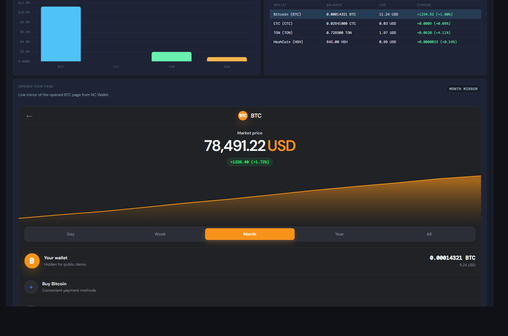
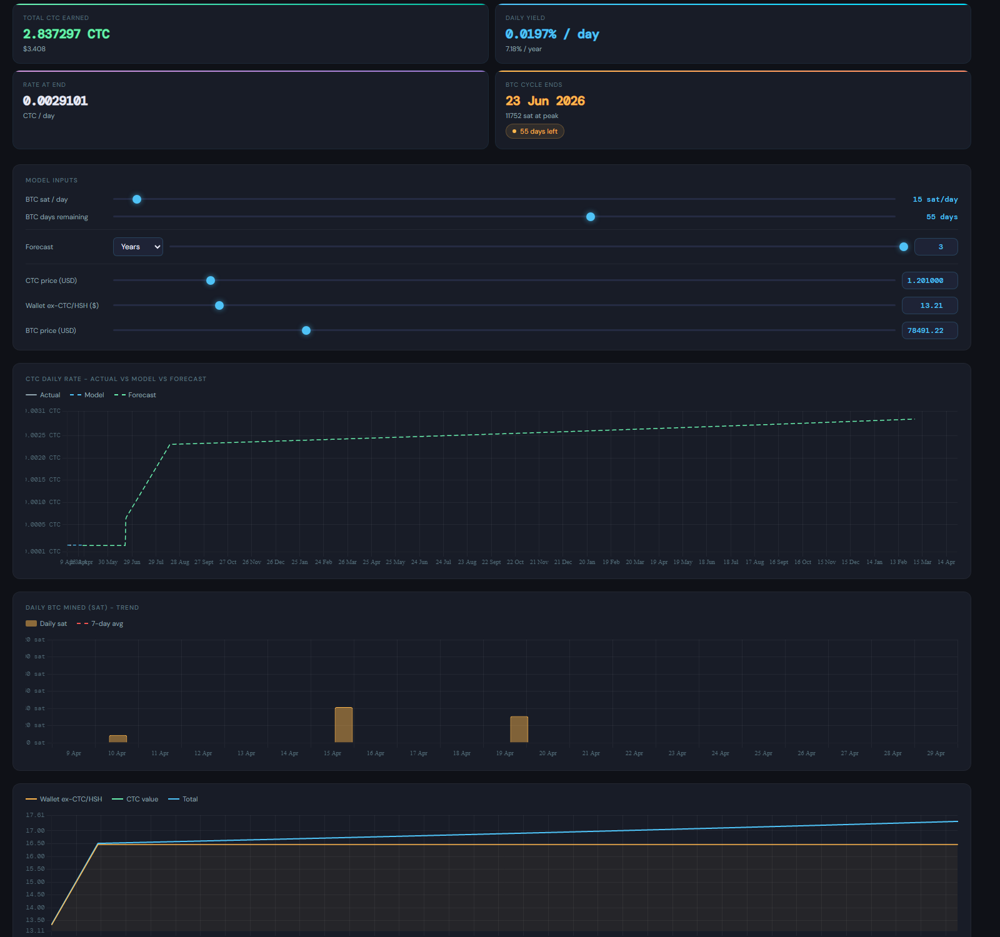

# ncwallet-signal-forge

Local NC Wallet research workspace for syncing wallet activity, mirroring coin pages, gathering time-range data, tracking ratio signals, and building a growing dataset for daily analysis and later ML work.

This repo is meant to be used as a practical local tool, not a polished public SaaS app. It keeps the wallet-facing workflow, charting, forecasting, backlog tracking, and data gathering in one place so day-to-day research does not get scattered across tabs, notes, and half-finished scripts.

## What this project does

- Mirrors live NC Wallet wallet pages inside a local dashboard
- Syncs wallet balances and visible transaction history from an authenticated browser session
- Stores local research data in a shared JSON database
- Tracks ratio pairs, overlays, signals, and saved forecast snapshots
- Runs a gatherer sidecar that can walk funded wallet coins across `Day`, `Week`, `Month`, and `Year`
- Includes a small ML sidecar scaffold for future model experimentation
- Keeps an in-app to-do list and bug list so the workspace itself remembers what still needs work

## Why use it

This project exists because the useful work is not only "look at price" or "scrape one page".

The actual workflow is closer to this:

1. Keep NC Wallet open and authenticated.
2. Sync wallet state and recent history into a local dashboard.
3. Compare wallet changes with ratio charts, model inputs, and forecast history.
4. Gather missing coin-page data while away from the keyboard.
5. Save what was surfed so the dataset grows over time instead of disappearing between sessions.

That is what this repo is built for.

## Main pieces

- `index.html`
  The main dashboard shell. Dashboard styling and browser logic live in `assets/dashboard.css` and `assets/dashboard.js`.

- `server.js`
  The local app server on `127.0.0.1:4173`. It serves the dashboard and owns the shared local DB at `data/surf-db.json`.

- `gatherer-sidecar/server.js`
  The gatherer on `127.0.0.1:4290`. It uses the authenticated NC Wallet browser session to surf funded wallet coin pages and save page snapshots.

- `todo-runner-sidecar/server.js`
  The queue runner on `127.0.0.1:4295`. It handles real automated to-do actions that have an actual backend handler.

- `ml-sidecar/server.js`
  The ML scaffold on `127.0.0.1:4280`. It reads from the same DB and is meant for future prediction experiments.

- `static-data/`
  Read-only gathered-data view.

## Requirements

- Windows environment
- Node.js 18+ recommended
- An authenticated NC Wallet browser session
- A Chromium browser started with remote debugging on port `9222`

The current services use built-in Node modules only, but the repository includes a root `package.json` so CI and local smoke checks have stable commands.

## Quick start

### 1. Start a remote-debuggable browser and log in to NC Wallet

Open Edge or Chrome with remote debugging on port `9222`, then log in to NC Wallet.

The project expects the authenticated wallet page to be visible through:

- `http://127.0.0.1:9222/json/list`

If you already have a prompted browser window from your local agent workflow, keep using that one.

### 2. Install and verify the workspace

```powershell
npm ci
npm test
```

`npm test` runs syntax checks plus service smoke checks against temporary localhost ports.

### 3. Start the main dashboard server

```powershell
node server.js
```

Then open:

```text
http://127.0.0.1:4173
```

### 4. Optional sidecars

Gatherer:

```powershell
node gatherer-sidecar/server.js
```

Queue runner:

```powershell
node todo-runner-sidecar/server.js
```

ML scaffold:

```powershell
node ml-sidecar/server.js
```

The ML sidecar reads feature inputs from `data/surf-db.json`. When the running Node version provides `node:sqlite`, prediction calls also persist forecast runs to `ml-sidecar/db/ml-sidecar.sqlite`.

Corridor Forge:

```powershell
node apps/corridor-forge/server.js
```

## Daily use

### Wallet sync

Use `Sync wallet` in the dashboard when the NC Wallet browser tab is open on:

- `Wallets`
- `History`
- a specific coin wallet page

The sync pulls what is currently visible, merges it into the local DB, and updates:

- wallet totals
- funded wallet list
- recent history table
- mirrored opened coin page
- model inputs and chart state

Sanitized proof-of-concept screenshots below use the built-in demo mode at `?demo=1`. Wallet identity is hidden and balances are intentionally altered.





### Gatherer

Use the gatherer page when you want broader coin-page coverage than a normal wallet sync gives you.

The gatherer can:

- discover funded wallet targets
- reuse cached and manually added watched targets
- walk `Day`, `Week`, `Month`, and `Year` views
- save wallet page snapshots into the shared DB
- skip full long-range sweeps when `Week` / `Month` / `Year` were already gathered earlier that day

### Ratio monitor and forecasts

The ratio module is for comparing one asset against another and saving what you looked at.

It can:

- plot live pair candles
- apply overlays and signal views
- save signal-view snapshots
- generate forecast archive entries
- compare saved forecasts against later actual data

## Local data

The shared local DB is:

```text
data/surf-db.json
```

It stores things like:

- wallet sync snapshots
- wallet page views
- cached history rows
- signal-view snapshots
- forecast data
- to-do items
- bug items

This file is intentionally gitignored in the repo because it can contain personal wallet-derived data.

## Configuration

Defaults are local-only and can be overridden with environment variables. Copy `.env.example` when you need a reference for ports and service URLs.

Key defaults:

- Main dashboard: `127.0.0.1:4173`
- Gatherer sidecar: `127.0.0.1:4290`
- ML sidecar: `127.0.0.1:4280`
- Todo runner: `127.0.0.1:4295`
- Corridor Forge: `127.0.0.1:4186`
- Browser DevTools: `http://127.0.0.1:9222/json/list`

Keep these services bound to localhost unless you have added your own network protections. Local data and browser-control endpoints can expose wallet-derived research state.

## Project To-Do

The `Project To-Do` block in the app footer exists because this project is not a normal static codebase. It is a live workspace shared between:

- the user
- the dashboard
- local sidecars
- a coding agent working in the same repo

Instead of keeping that context in separate notes, prompts, and memory, the backlog is stored in the workspace itself.

### Why it exists

- To keep ongoing work visible inside the app being worked on
- To preserve task context between sessions
- To show what is finished versus what is still open
- To let automation and manual work live in the same surface
- To make agent-driven iteration less lossy

### How it is meant to work

- New requested capabilities become to-do items
- Complaints about broken behavior can become bug items
- Priority decides what should be attacked first
- Some tasks are manual/planning only
- Some tasks can have a real automation handler
- Only truly automated tasks should be queueable

The queue is not meant to pretend every task is automatable. If a task has no real backend handler, it should stay manual or explicitly show as unautomated.

## Bug list

The bug list sits below the to-do list on purpose.

The split is simple:

- `To-Do` = new capability or planned work
- `Bugs` = broken, misleading, stale, or regressed behavior

That separation helps keep "build this" different from "this already exists but is wrong".

## Repo layout

```text
.
|-- index.html
|-- server.js
|-- package.json
|-- assets/
|-- tests/
|-- data/
|-- gatherer-sidecar/
|-- todo-runner-sidecar/
|-- ml-sidecar/
|-- apps/corridor-forge/
|-- static-data/
`-- ML_SERVER_PLAN.md
```

## Notes

- This is a local-first project.
- It depends on an authenticated NC Wallet browser session.
- Saved local data may reflect only what was actually visible or gathered at the time.
- Forecasts and signals are research helpers, not trading advice.

## Current repo scope

The initial repo commit intentionally excludes:

- `data/surf-db.json`
- runtime log files like `server-*.log`

That keeps the code public without publishing local wallet-derived working data.
